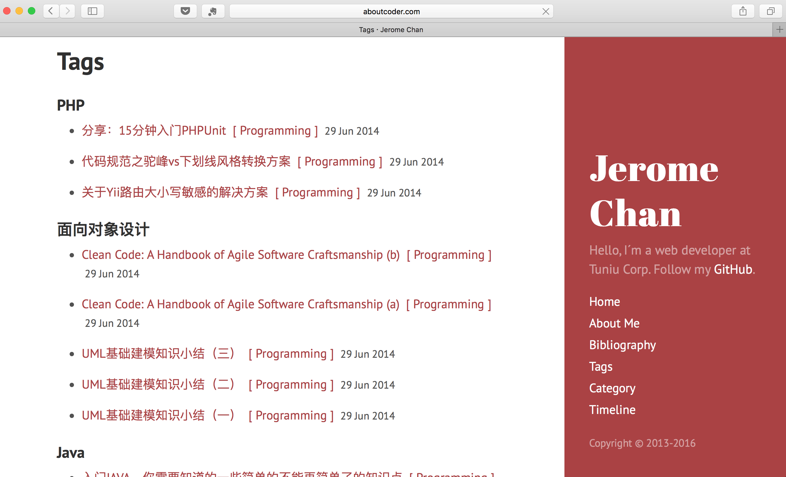
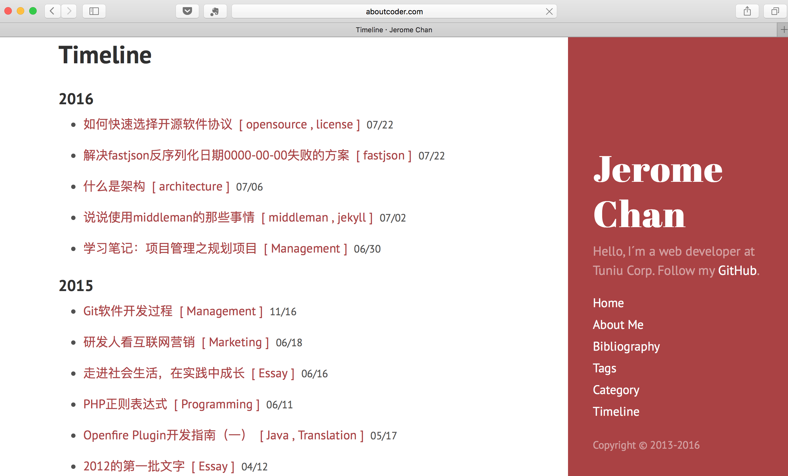
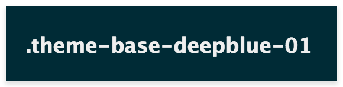

# Hyde for Jekyll 3

[](https://www.codacy.com/app/jerome.chan369/hyde-for-jekyll-v3?utm_source=github.com&amp;utm_medium=referral&amp;utm_content=jeromechan/hyde-for-jekyll-v3&amp;utm_campaign=Badge_Grade)

> "Hyde for Jekyll 3" is an upgrading [Jekyll](http://jekyllrb.com) theme that base on [poole/hyde](https://github.com/poole/hyde), which is an awesome Jekyll theme on [GitHub](https://github.com) and [getpool.com](http://getpoole.com/). 
> 
> We developed not only to help the original Hyde support Jekyll v3, but also provide useful features for blogging.

## Features we have done

### 1. Support Jekyll v3  

The original version doesn't support Jekyll v3 currently. At the same time, [poole/hyde](https://github.com/poole/hyde) doesn't accept pull request for a long time.
We suggest every developer to finish compatible jobs with Jekyll v3.

### 2. Add tags, categories, timeline pages

**- Tags page** 



**- Categories page**


**- Timeline page**



### 3. Append related post partial to 404 page


### 4. Integrate a shell script for GitHub pages deploying

To use this shell, you must obtain branches named source & master firstly.

```shell
## For *nux and MacOS only currently.
> sh jekyll-deploy.sh
```

### 5. Add sitemap files for friendly SEO

Base on the original atom.xml, We extra added sitemap files such as sitemap.xml, feed.xml for friendly SEO. 

### 6. Add a new blue theme 
 


To use a theme, add anyone of the available theme classes to the <body> element in the default.html layout, like so:

```html
<body class="theme-base-deepblue-01">
  ...
</body>
```

### 7. Others code improvements in performance aspects

## Original Hyde User Guide

Hyde is a brazen two-column [Jekyll](http://jekyllrb.com) theme that pairs a prominent sidebar with uncomplicated content. It's based on [Poole](http://getpoole.com), the Jekyll butler.


## Contents

- [Usage](#usage)
- [Options](#options)
  - [Sidebar menu](#sidebar-menu)
  - [Sticky sidebar content](#sticky-sidebar-content)
  - [Themes](#themes)
  - [Reverse layout](#reverse-layout)
- [Development](#development)
- [Author](#author)
- [License](#license)


## Usage

Hyde is a theme built on top of [Poole](https://github.com/poole/poole), which provides a fully furnished Jekyll setup—just download and start the Jekyll server. See [the Poole usage guidelines](https://github.com/poole/poole#usage) for how to install and use Jekyll.


## Options

Hyde includes some customizable options, typically applied via classes on the `<body>` element.


### Sidebar menu

Create a list of nav links in the sidebar by assigning each Jekyll page the correct layout in the page's [front-matter](http://jekyllrb.com/docs/frontmatter/).

```
---
layout: page
title: About
---
```

**Why require a specific layout?** Jekyll will return *all* pages, including the `atom.xml`, and with an alphabetical sort order. To ensure the first link is *Home*, we exclude the `index.html` page from this list by specifying the `page` layout.


### Sticky sidebar content

By default Hyde ships with a sidebar that affixes it's content to the bottom of the sidebar. You can optionally disable this by removing the `.sidebar-sticky` class from the sidebar's `.container`. Sidebar content will then normally flow from top to bottom.

```html
<!-- Default sidebar -->
<div class="sidebar">
  <div class="container sidebar-sticky">
    ...
  </div>
</div>

<!-- Modified sidebar -->
<div class="sidebar">
  <div class="container">
    ...
  </div>
</div>
```


### Themes

Hyde ships with eight optional themes based on the [base16 color scheme](https://github.com/chriskempson/base16). Apply a theme to change the color scheme (mostly applies to sidebar and links).


There are eight themes available at this time.


To use a theme, add anyone of the available theme classes to the `<body>` element in the `default.html` layout, like so:

```html
<body class="theme-base-08">
  ...
</body>
```

To create your own theme, look to the Themes section of [included CSS file](https://github.com/poole/hyde/blob/master/public/css/hyde.css). Copy any existing theme (they're only a few lines of CSS), rename it, and change the provided colors.

### Reverse layout


Hyde's page orientation can be reversed with a single class.

```html
<body class="layout-reverse">
  ...
</body>
```


## Development

Hyde has two branches, but only one is used for active development.

- `master` for development.  **All pull requests should be submitted against `master`.**

Follow and contact me on GitHub, Sina Weibo or Email. 
If you find an issue, just open a ticket on it. Pull requests are warmly welcome as well.

## Authors
- Original author: **Mark Otto**
	- GitHub: <https://github.com/mdo>
	- Twitter: <https://twitter.com/mdo>

- Current repo owner: **Jerome Chan**
	- GitHub: <https://github.com/jeromechan>
	- Weibo: <http://weibo.com/5812529126>

## License

Open sourced under the [MIT license](LICENSE.md).


